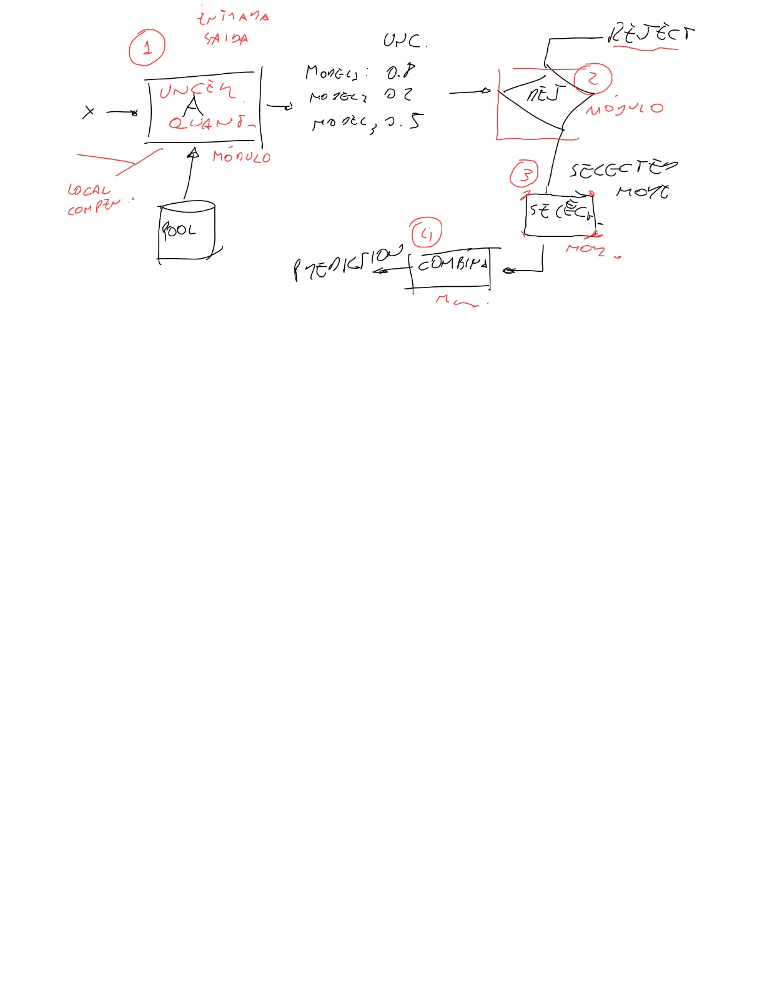

# 23/01

**Modificações para o plugin e o METADES-R**

- Mudar o METADES-R e plugin de volta para rejection via threshold, ao invés de reject rate
- Quando todos os modelos forem classificados como não-competentes, rejeitar a instância (ou não, provavelmente não vai fazer muita diferença no final)
- Pool/Plugin agora também terá seleção dinâmica dos modelos

# 10/12

(Não, eu não fiquei esse tempo todo sem fazer nada, eu só não precisei escrever aqui)

**META-DES**

- Basicamente, o METDA-DES pega 5 meta-features para cada instância, dá de entrada para um meta-classificador e ele vai dizer se o modelo-base é competente ou não para fazer a classificação. Foram feitos melhorias desde o modelo original, e agora o meta-modelo é um regressor, que vai retornar um score de competência e os modelos-base com um score acima de um limiar pré-definido serão escolhidos.
- Quais as questões:
  - É possível que nenhum modelo seja compentente? E portanto nenhum modelo seria escolhido para realizar a classificação? O que aconteceria nesses casos? Que tipo de resposta seria dada?
  - Como transformar isso na framework pensada desde o início? 
    - Uma opção é só incluir o META-DES depois da rejeição das instâncias, com os mesmos modelos utilizados no pool
    - Outra opção é alterar o modelo disponibilizado pela biblioteca deslib para acrescentar rejeição de instâncias por taxa de rejeição. Eu tinha pensado em alvez usar o score de competência retornado pelo meta-modelo para calcular/escolher quais instâncias devem ser rejeitadas ou não. Tipo, dada uma matriz [X]$_{IJ}$ onde $I = \{0,1,2,...\ ,m\}$ representam instâncias de dados no dataset de entrada e $J = \{0,1,2,...\ ,n\}$ representam os modelos-base do pool, e cada item $x_{ij}$ representa o score de compentência de um modelo-base $j \in J$ para a instância $i \in I$, poderiam ser tirados os vetores de competências $v_{i} = \begin{pmatrix}x_{i0} & x_{i1} & ... & x_{in} \end{pmatrix}^T$ para cada instância e fazer uma operação para decidir se aquele exemplo deverá ser rejeitado ou não, por exemplo, calcular a média das competências de $v_{i}$ e, antes de seguir com a predição, rejeitar as $0.2*n$ instâncias com menores médias.

# 24/08

**Pool de modelos**

- Dentro do pool vc seleciona os melhores modelos (mais competentes) para classificar uma instância
  - Se nenhum for bom, então rejeita uma instância
  - Exemplo de fronteira: seria rejeitado por vários modelos, mas talvez aceito por algum grupo de modelos

- Codificar incertezas pela probabilidade de classe e tirar a incerteza baseada nisso (com ponto de corte 0.8)

- Taxa de rejeição: quantos % máximo da amostra de dados você pode rejeitar (seria classificado manualmente). Com um classificador é moleza, mas com vários é mais complicado pq nn seria exatamente 20%
  - Nesse caso, a questão é: Como escolher esses 20%? Tirar uma **média/mediana das probabilidades de classe**? Ou pela **mínima/máxima probabilidade do pool** (para cada instância, usar a mínima/máxima probabilidade da classe correta dela entre os classificadores do DSS-Dynamic Subgroup Selector...? ) ? 

  - Esquema:
    
    - *(Se for seguir esse esquema, então seria usado, na verdade, um rejeitor separado dos modelos, ao invés de ser dependente deles)*

  - Primeiro precisa ver as instâncias que foram rejeitadas por todos os modelos. Essas *tem* que contar nos 20% 
  
    

- Começar fazendo sem assessores. Apenas pelas probabilidades de classes

- Como medir a performance do modelo? Medindo a acurácia das predições das instâncias escolhidas, pelos modelos escolhidos.

- Verificar o dataset a ser utilizado, provavelmente um do airbnb que usaram em um dos papers que prudêncio mencionou na reunião. verificar métricas e coisas sobre machine learning com opção de rejeição.

